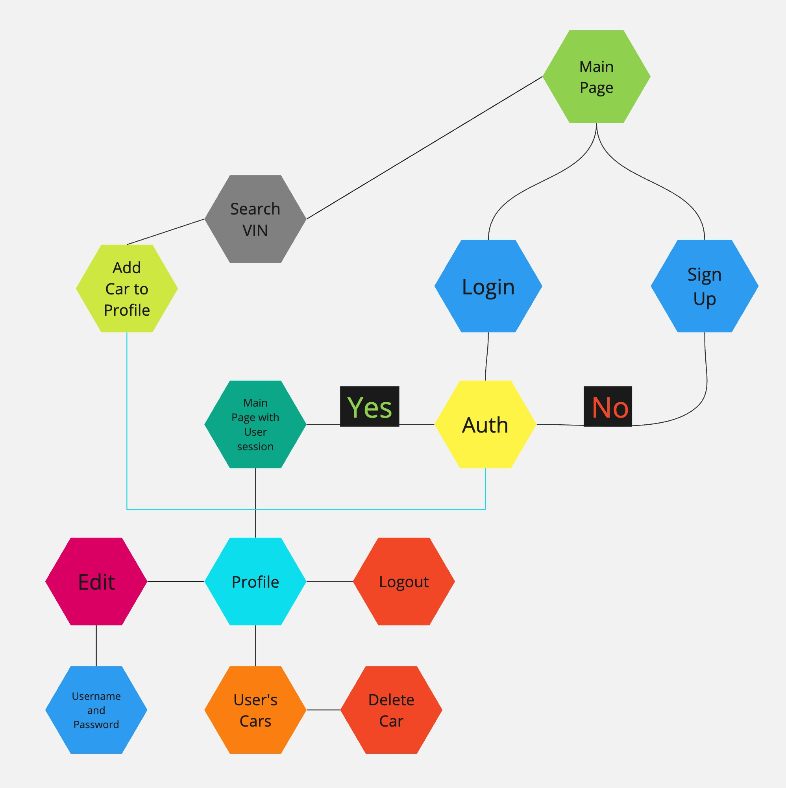
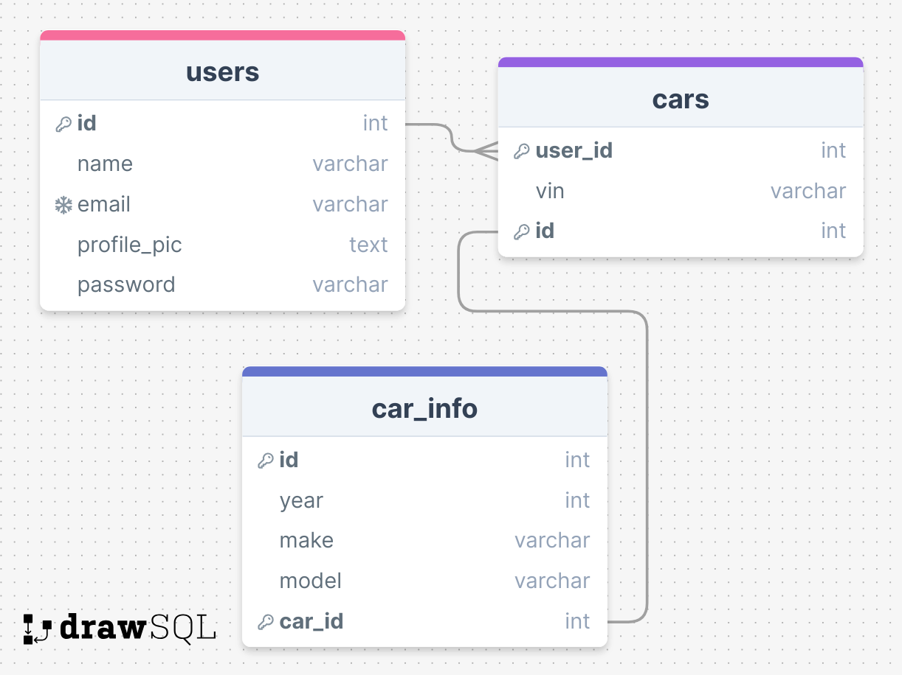

# Car Lookup

### Author: Kyamran Rizayev

### Springboard Software Engineering Career Track

### Capstone 1: Project Proposal

# Project Proposal

| **Question**                                                                                                                                                 | **Answer**                                                                             |
| ------------------------------------------------------------------------------------------------------------------------------------------------------------ | -------------------------------------------------------------------------------------- |
| **What goal will your website be designed to achieve?**                                                                                                      | It will let users look up car information by using the VIN of the car.                 |
| **What kind of users will visit your site? In other words, what is the demographic of your users?**                                                          | Mechanics, Dealerships, anyone that needs info about a specific car.                   |
| **What data do you plan on using? You may have not picked your actual API yet, which is fine, just outline what kind of data you would like it to contain.** | [API](https://vpic.nhtsa.dot.gov/api/)                                                 |
| **What does your database schema look like?**                                                                                                                | [Schema](#database-schema)                                                             |
| **Is there any sensitive information you need to secure?**                                                                                                   | Yes, user's password                                                                   |
| **What will the user flow look like?**                                                                                                                       | [App Flow](#app-flow)                                                                  |
| **What tech stack will you use for your final project?**                                                                                                     | Python/Flask, SQLAlchemy, PostgreSQL, WTForms, JavaScript, HTML, CSS, Bootstrap, Jinja |
| **Will this be a website? A mobile app? Something else?**                                                                                                    | Website                                                                                |

# App Flow

# Database Schema

